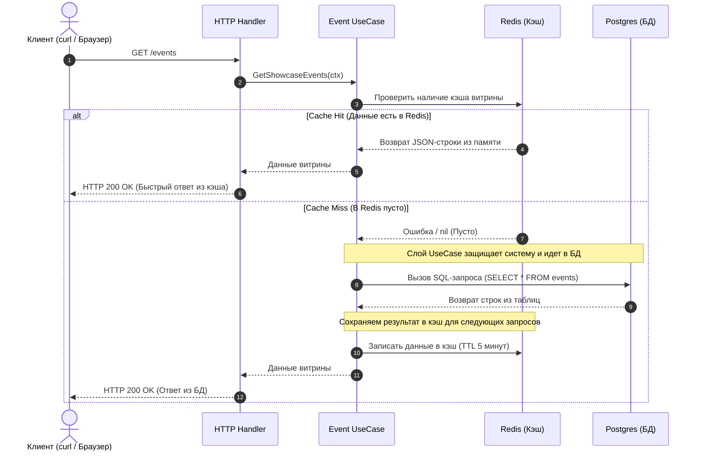

# Архитектура проекта Ticket Aggregator

В данном документе описано внутреннее устройство сервиса агрегации билетов, взаимодействие его компонентов и логика кэширования.

## 1. Диаграмма компонентов (C4 Component)

Сервис спроектирован по принципам чистой архитектуры (Clean Architecture). Слои строго изолированы друг от друга через интерфейсы.

```mermaid
componentDiagram
    Title: C4 Component Diagram — Агрегатор Билетов

    Boundary(api, "Интерфейс ввода (Перенос в Веб-сервер)") {
        [HTTP Handler] as handler
    }

    Boundary(business, "Бизнес-логика") {
        [Event UseCase] as uc
    }

    Boundary(storage, "Слой хранения данных") {
        [Postgres Repository] as pg_repo
        [Redis Cache Repository] as redis_repo
    }

    handler --> uc : Вызов бизнес-логики (Контекст)
    uc --> redis_repo : 1. Запрос кэша (Get)
    uc --> pg_repo : 2. Запрос БД при Cache Miss

    database "PostgreSQL" #database {
        [Таблица: events] as db_events
    }
    database "Redis" #database {
        [Кэш: showcase] as db_cache
    }

    pg_repo --> db_events : SQL (pgxpool)
    redis_repo --> db_cache : TCP (go-redis)
```

## 2. Сценарий: Получение витрины мероприятий (Sequence Diagram)

Для защиты основной базы данных от высокой нагрузки на чтение реализован паттерн «Бронежилет» (Ленивое кэширование с ограниченным временем жизни TTL).



## 3. Инфраструктурное развертывание (Docker Compose)
Вся экосистема автоматизирована и поднимается в изолированной сети `ticket-network`:
* **ticket-app**: Go-сервер (сокращен до 15.3 МБ через Multi-stage build).
* **postgres-db**: СУБД с выделенным томом `postgres_data` для персистентности данных и авто-накатом таблиц при старте.
* **redis-db**: In-memory хранилище кэша.
