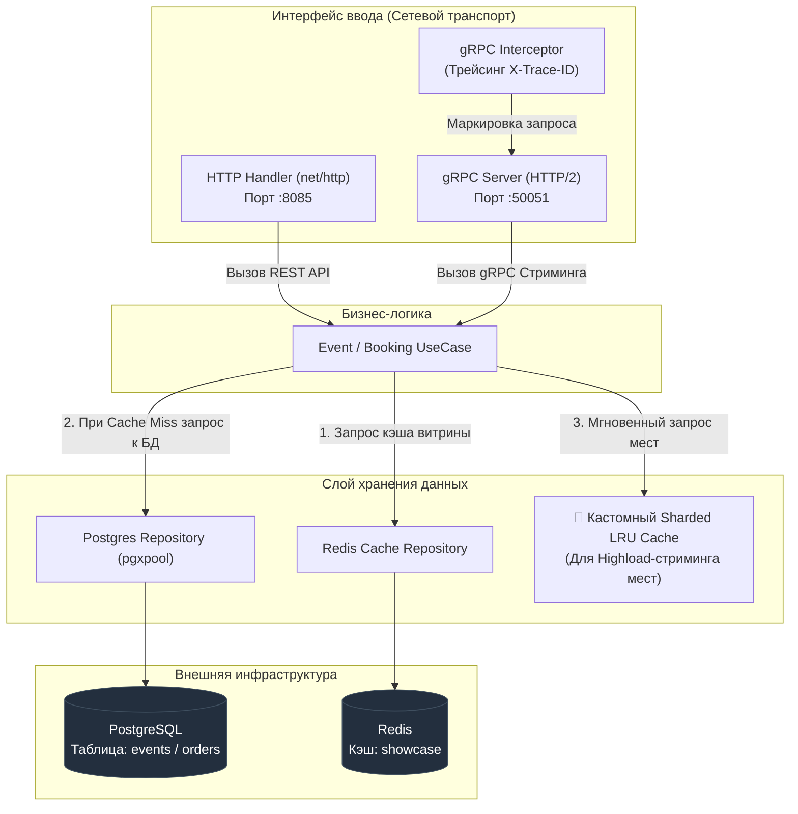
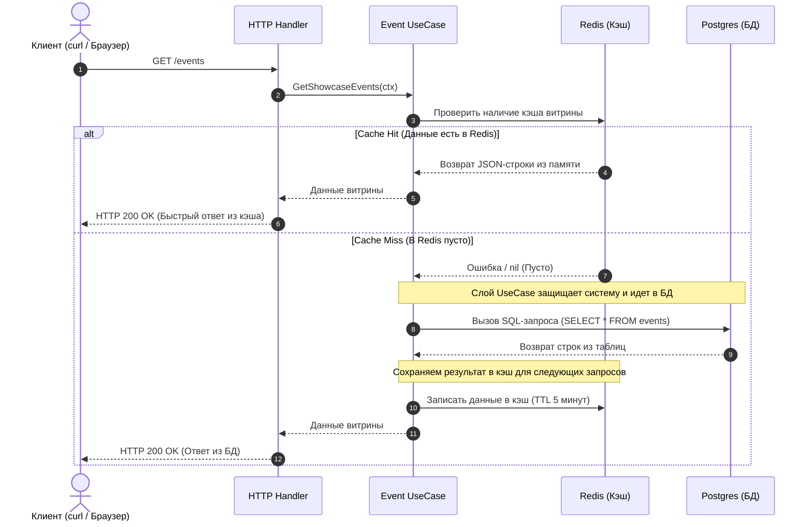
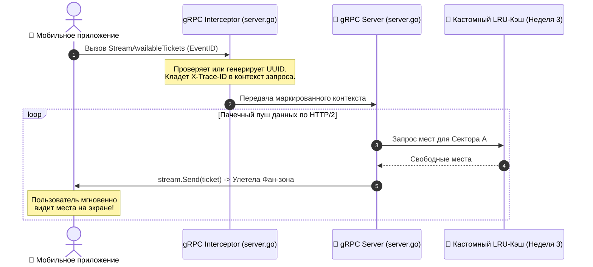
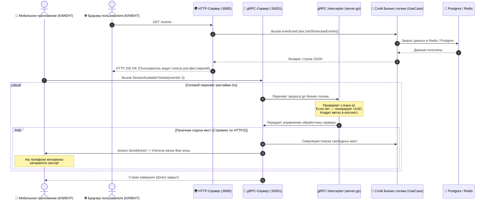
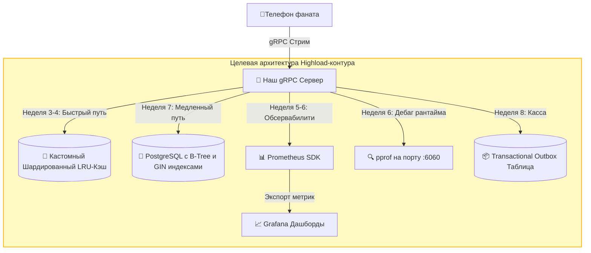

# Архитектура проекта Ticket Aggregator (Букинг Мероприятий)

Сервис спроектирован по принципам чистой архитектуры (Clean Architecture) и поддерживает два параллельных сетевых интерфейса для разных бизнес-задач.

## Интерфейсы ввода и транспортные протоколы

1. **HTTP REST API (Порт :8085)** — используется для интеграции с веб-браузерами и внешними партнерами. Обслуживает Витрину (`/events`) и Кассу (`/bookings`).
2. **gRPC HTTP/2 Streaming (Порт :50051)** — используется для высоконагруженного мобильного приложения. Обслуживает реактивный стриминг свободных мест в зале в реальном времени.

## 1. Диаграмма компонентов (C4 Component)

Слои строго изолированы друг от друга через интерфейсы. 
Бизнес-логика ничего не знает о сетевых протоколах или конкретных базах данных.

## 2. Сценарий 1: Получение витрины мероприятий (HTTP REST)
Реализован паттерн «Бронежилет» (Ленивое кэширование с TTL) для защиты основной БД от нагрузок на чтение.

## 3. Сценарий 2: Стриминг свободных мест в зале (gRPC Stream)
Маркирует каждый входящий поток уникальной меткой `X-Trace-ID` через Интерцептор и пачками пушит сектора зала клиенту по HTTP/2, минуя накладные расходы текстового JSON.

## 4. Инфраструктурное развертывание (Docker Compose)
Вся экосистема автоматизирована и поднимается в изолированной сети `ticket-network`:
* **ticket-app**: Go-сервер (сокращен до 15.3 МБ через Multi-stage build).
* **postgres-db**: СУБД с выделенным томом `postgres_data` для персистентности данных и авто-накатом таблиц при старте.
* **redis-db**: In-memory хранилище кэша.

## 5. Взаимодействие компонентов в реальном времени (Что работает сейчас)

## 6. Технологический Roadmap (Что планируется сделать в будущем)

*   **Неделя 3–4 (Concurrency-кэш):** Замена симуляции стриминга на чтение из собственного потокобезопасного in-memory кэша на дженериках, разделенного на 256 шардов для минимизации конкуренции за мьютексы (Lock Contention).
*   **Неделя 5–6 (Обсервабилити продакшена):** Интеграция Prometheus SDK и вывод бизнес-метрик (RPS, Latency перцентили p99, Cache Hit Rate) на дашборды Grafana. Подключение встроенного профилировщика рантайма `pprof` на изолированном порту `:6060` для анализа Flame Graph памяти под нагрузкой.
*   **Неделя 7–8 (Оптимизация хранения и Надежность):** Проектирование физических схем таблиц базы данных, накат индексов `B-Tree` и `GIN` в фоне без блокировок продакшена (`CONCURRENTLY`), внедрение паттерна `Transactional Outbox` для атомарной отправки событий бронирования в брокеры сообщений.